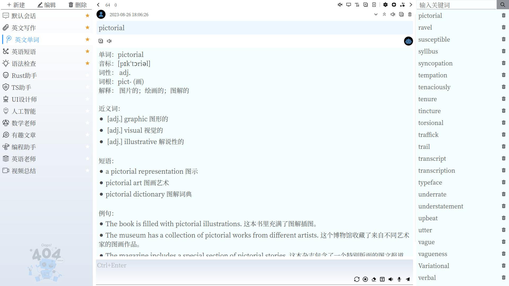

[English Document](./README.md)

#### 介绍
基于OpenAI chatgpt-3.5-turbo API 的聊天机器人。程序使用`Slint-UI`和`Rust`编写。

#### 功能
- [x] 支持`OpenAI chatgpt-3.5-turbo 4k 和 16k` 和 `Azure OpenAI chatgpt-35-turbo 4k`
- [x] 新建、保存、删除会话
- [x] 为每个会话配置`system prompt`
- [x] 支持删除一次会话提问，清空当前会话，停止当前会话
- [x] 支持配置是否启用历史会话模式
- [x] 支持`Socks5`代理配置
- [x] 支持中英界面
- [x] 支持中英双语朗读
- [x] 支持对话归档
- [x] 支持录音转文字输入
- [x] 支持不同会话并发输出
- [x] 支持快捷指令切换会话并发送问题

#### 如何构建？
- 安装`Rust`和`Cargo`
- 执行`make build`
- [Makefile](./Makefile)了解更多

#### 参考
- [Slint Language Documentation](https://slint-ui.com/releases/1.0.0/docs/slint/)
- [github/slint-ui](https://github.com/slint-ui/slint)
- [Viewer for Slint](https://github.com/slint-ui/slint/tree/master/tools/viewer)
- [LSP (Language Server Protocol) Server for Slint](https://github.com/slint-ui/slint/tree/master/tools/lsp)
- [azure text2speech](https://learn.microsoft.com/zh-cn/azure/cognitive-services/speech-service/text-to-speech)
- [speech-synthesis-markup-voice](https://learn.microsoft.com/zh-cn/azure/cognitive-services/speech-service/speech-synthesis-markup-voice)
- [rest-speech-to-text-short](https://learn.microsoft.com/zh-cn/azure/cognitive-services/speech-service/rest-speech-to-text-short)
- [Azure OpenAI 服务文档](https://learn.microsoft.com/zh-cn/azure/cognitive-services/openai/)
